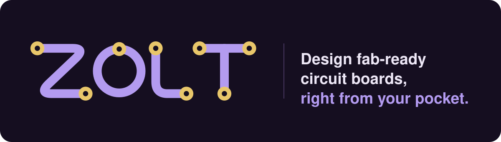

<p align="center">
  
</p>

<p align="center">
  Schematic capture and PCB layout for Android, from the first resistor to
  Gerbers you can send off to be made.
</p>

<p align="center">
  <a href="LICENSE"></a>
  
  
  
</p>

---

Zolt lets you design a circuit board on your phone. You draw the schematic,
lay out the board, check it against your fab's rules and export the files to
get it made. No laptop needed.

It works with KiCad files, so you can start something on the desktop, carry
on with it on your phone, and open it back up in KiCad later. Or skip the
desktop completely and send the Gerbers straight to JLCPCB, PCBWay or
whoever you use.

Everything stays on your phone. There's no account, no cloud and no
subscription, and your designs only go somewhere if you send them.

## Why Zolt

**It's made for touch.** Doing precise work with a fingertip on a small
screen is usually miserable, so the board editor works the other way round:
the crosshair stays put in the middle of the screen and you move the board
under it. You can always see exactly where a point is going to land.

**It speaks KiCad.** Zolt reads and writes KiCad's own schematic, board and
project files, sub-sheets and all. The exports are tested against the real
`kicad-cli`, so what you draw here is what KiCad opens.

**The libraries are the ones you know.** You can download KiCad's official
symbol and footprint libraries from inside the app (over 20,000 parts) or
import your own.

**The output is ready to order.** Gerbers, drill files, a BOM and a
pick-and-place file, zipped up and ready to upload. There are presets for
real board houses that check your design against what they can actually make.

## What it can do

### Schematic
- A parts panel with the common parts one tap away, plus search across every
  library you've installed
- Drag wires out of pins, or tap them out corner by corner if you prefer
- Net labels, power and ground symbols, no-connect flags and label ranges
  like `D[0..7]`
- Multi-unit parts, sub-sheets, notes and boxes
- An electrical rule check you can tune per project
- Undo and redo for everything

### Board
- 2, 4, 6 or 8 copper layers, with an editable stackup
- Draw your own board outline with rectangles, circles, triangles, arcs and
  lines, with snapping to corners and centres
- Walk-around routing, buses, differential pairs and curved tracks
- Copper pours with thermal reliefs, keepout areas and teardrops
- Through, blind and buried vias
- Net classes with impedance targets, net lengths and meanders for length
  matching
- Silkscreen text in a choice of fonts, and pictures or logos on the
  silkscreen
- A design rule check, plus manufacturability checks for real board houses
- The schematic and the board side by side, so you can see what's what

### Manufacturing
- Gerbers, Excellon drill files (slots come out as proper slots), a BOM with
  component IDs for assembly, and a pick-and-place file
- Panels with mouse bites or V-scoring, rails, fiducials and tooling holes
- A preview of what the finished board will look like, and a Gerber viewer to
  check the output
- A schematic PDF, and project backups you can move between phones

## Getting Zolt

Zolt will be on Google Play soon. Until then you can build it yourself:

```bash
git clone https://github.com/JacobBico/ZoltPCB.git
cd ZoltPCB
flutter pub get
flutter build apk --release
```

Then install `build/app/outputs/flutter-apk/app-release.apk` on an Android
phone. Zolt is meant to be used in landscape.

The first time you open it, the home page has a short Get started list. The
first step downloads KiCad's parts libraries, which you'll want before
anything else.

## Where it's at

Zolt is still young and changing quickly. The exports are checked against
real KiCad and board houses accept them, but check your design, and look at
the Gerbers in your fab's viewer, before you order anything. If something
looks off, please [open an issue](../../issues).

There's no 3D view or autorouter yet. For those, open your project in desktop
KiCad.

## Contributing

Bug reports, ideas and pull requests are all welcome. Have a quick read of
[CONTRIBUTING.md](CONTRIBUTING.md) first. If you want to know how the app is
put together, including the design decisions and how to run the tests,
[docs/ARCHITECTURE.md](docs/ARCHITECTURE.md) covers it.

## License

Zolt is free software: you can redistribute it and/or modify it under the
terms of the GNU General Public License as published by the Free Software
Foundation, either version 3 of the License, or (at your option) any later
version. See [LICENSE](LICENSE).

In short: you can use, study, change and share Zolt, including commercially,
but anything you distribute that's built from it has to be released under the
same license, with its full source code.

It is distributed in the hope that it will be useful, but WITHOUT ANY
WARRANTY; without even the implied warranty of MERCHANTABILITY or FITNESS FOR
A PARTICULAR PURPOSE.

Copyright © 2026 JacobBico.

## Trademarks

"Zolt" and the Zolt logo are trademarks of JacobBico and aren't covered by
the license above. You're welcome to fork the code, but if you publish a fork,
on an app store or anywhere else, please give it a different name and logo so
nobody mistakes it for the original. Saying your project is "based on Zolt"
is fine.

KiCad's libraries are © the KiCad Library Team and licensed under CC-BY-SA 4.0,
with an exception that leaves the designs you make with them entirely yours.
Zolt downloads them when you ask; it doesn't ship them.
