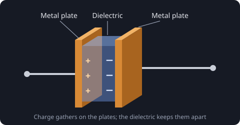
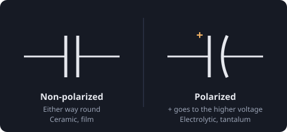
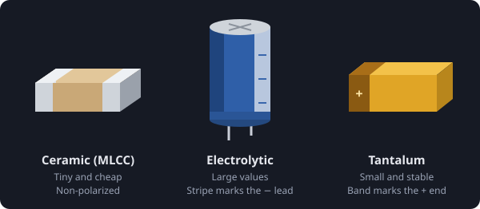

# Introduction to capacitors

The capacitor is one of the fundamental electronic components, and you will find it in almost every circuit you come across.

## How it is made

A capacitor is two metal plates with an insulator, called the **dielectric**, between them. When a voltage is put across it, charge gathers on the plates: positive on one side, negative on the other. The dielectric keeps them from meeting.

Different metals, dielectric materials and ways of building them give the many types of capacitor there are, each with its own strengths.

## How it behaves

A capacitor stores electrical charge, so you can picture it as a tiny battery. Unlike a battery it charges and discharges very quickly, which is exactly what makes it useful:

- It **blocks DC**: once charged, no steady current flows through it.
- It **passes AC**: a changing voltage keeps charging and discharging it, so current flows, and more easily the higher the frequency.
- It **smooths out changes**: it gives back its charge when the voltage dips and soaks it up when it rises.

How much charge it holds for a given voltage is its **capacitance**, measured in farads. Real parts are much smaller than a farad, so you will mostly see pF, nF and µF.

## Polarized and non-polarized

Some capacitors are **polarized**, meaning their orientation matters. Put one in backwards and the circuit may behave unexpectedly, stop working, or the capacitor itself may be damaged. The schematic symbol tells you which kind a part is.

> On a polarized capacitor, the + side always goes to the higher voltage. Check it on the schematic and again on the board's silkscreen.

## Common types

Capacitors come in many shapes and sizes, not only the standard SMD packages. To name the three you will meet most:

- **Ceramic (MLCC)**: by far the most common. They can be extremely small, are cheap, are non-polarized, and are great at high frequencies. Their capacitance drops as the DC voltage across them rises, so check the datasheet's derating curve.
- **Aluminium electrolytic**: reach high capacitance while staying fairly small, thanks to a very thin oxide layer as their dielectric. They are polarized, and the stripe on the can marks the negative lead.
- **Tantalum**: an electrolytic capacitor with tantalum oxide as its dielectric. They are stable and pack a lot of capacitance into a tiny space, which is why they turn up in phones. They are polarized too, but here the band marks the **positive** end.

> A tantalum capacitor put in backwards, or given too much voltage, can fail short and burn. Leave some voltage margin.
