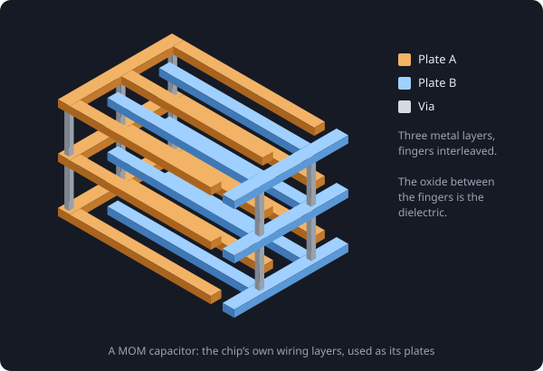

# Why chips need external capacitors

In almost every datasheet for a part you place on your board, an external capacitor is strongly recommended, and more often than not it is mandatory for the part to work at all.

External capacitors are there for many reasons: to keep noise out of the part, to help circuits inside the part work properly, or to complete a filter the part needs.

That raises a natural question: why don't the designers just put the capacitors inside the chip, so we can use the part as it is?

## Because they would not fit

The answer is size. Capacitance needs area, and on a chip, area is the most expensive thing there is.

The capacitors built into chips store only about **1 to 2 fF for every square micrometre** of silicon. A single ordinary 100 nF decoupling capacitor would need:

```
100 nF ÷ 2 fF/µm² = 50,000,000 µm² = 50 mm²
```

That is a square about 7 mm on a side, bigger than many whole chips, for one capacitor. A 1 µF capacitor would need around 500 mm². A 0402 ceramic capacitor on your board does the same job in a fraction of a square millimetre, because it is built from hundreds of plates stacked on top of each other.

> So chips keep only picofarads to a few nanofarads inside. Anything bigger goes on the board, next to the chip.

## The capacitors that are inside

Chips do use capacitors internally, just small ones. An ADC's switched-capacitor circuits are a good example. These are often **MOM capacitors** (metal-oxide-metal).

A MOM capacitor needs no special materials. The designers take the chip's own wiring layers, draw interleaved fingers of copper on several of them, and join each set together with vias. One set of fingers is one plate, the other set is the other plate, and the oxide insulating the wires from each other is the dielectric.



Most of the capacitance comes from the sideways field between neighbouring fingers, which is why they are also called **fringe capacitors**.

Two other kinds you may come across:

- **MIM capacitors** (metal-insulator-metal): true parallel plates, with a thin dielectric layer added between two metal layers. More precise, but it costs an extra manufacturing step.
- **MOS capacitors**: use a transistor's gate oxide as the dielectric. The densest of the three, but their value changes with voltage, so they are mostly used to decouple the chip's own supply.
