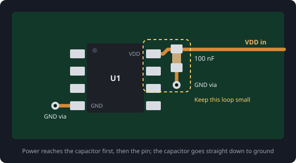

# Decoupling

When a chip switches, it draws current in short, sharp bursts. The supply is too far away, through too much trace, to deliver those bursts instantly, so the voltage at the pin dips and noise spreads to everything else on the same supply.

A **decoupling capacitor** fixes this. It sits right beside the power pin as a small local store of charge: it covers the sudden bursts itself and shunts high-frequency noise straight to ground, before it can reach the rest of the board.

## The rule of thumb

- Put a **100 nF** ceramic capacitor on **every VDD pin** the part has.
- Add a larger one, **1 to 10 µF**, per chip or per group of chips, to cover slower changes.
- If a pin such as VSS is supplied with a **negative voltage**, treat it the same way as VDD.

## Placement is everything

A decoupling capacitor only works if it is close. Every millimetre of trace between it and the pin adds inductance, and inductance is exactly what stops fast current from flowing.

- Place it **as close to the pin as you can**, on the same side of the board.
- Route power **into the capacitor first**, then on to the pin.
- Take the capacitor's other pad **straight down to ground** through its own via.
- When there are several values on one pin, the **smallest goes closest**.

> Think of the loop from the capacitor, into the pin, out through the chip's ground and back. The smaller that loop, the better the capacitor works.

## Read the datasheet

This does not apply to every power pin. A part may have several power pins, some needing a different voltage, a particular capacitor value, a ferrite bead, or a resistor instead. Pins named VCAP, VREF or AVDD are common examples. Read the datasheet carefully: its recommended layout is the best guide there is to avoid a misbehaving device.
