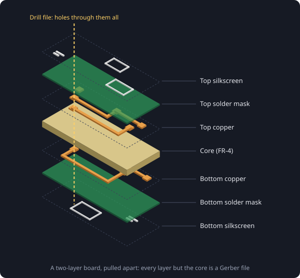

# What the fab needs from you

A board house does not open your design. It works from a set of plain files, one for each thing its machines do, and makes exactly what those files say. Knowing what is in them makes it much easier to spot a problem before you pay for it.

## Gerbers

A **Gerber** file is a picture of one layer of the board. A normal two-layer board needs:

- **Copper**, top and bottom: every track, pad and pour.
- **Solder mask**, top and bottom: the openings where the green coating is left off, so pads can be soldered.
- **Silkscreen**, top and bottom: the white printing, reference designators and logos.
- **Paste**, top and bottom: where solder paste goes. Only needed if the board is being assembled.
- **Edge cuts**: the outline the board is cut along, and any slots or cut-outs inside it.

A four-layer board adds two inner copper layers, and so on.

## Drill files

Holes are not in the Gerbers. They go in separate **Excellon** drill files: the position and size of every hole, with plated holes (vias and through-hole pads) kept apart from unplated ones (mounting holes).

## For assembly

If the fab is also going to solder the parts on, it needs two more files:

- The **BOM** (bill of materials): which part goes where, with a part number the assembler can order.
- The **pick-and-place** file: the exact position, rotation and side of every part.

> In Zolt, **GERBERS + DRILL** writes the board files and **FOR ASSEMBLY** adds the BOM and pick-and-place. **SHARE ZIP** packs them up ready to upload.

## Check before you order

Always open the zip in your fab's own online viewer before paying. It shows the board the way their machines will read it: a missing layer, an outline that is not closed, or a silkscreen label sitting on a pad is easy to see there and very expensive to find on the real board.
