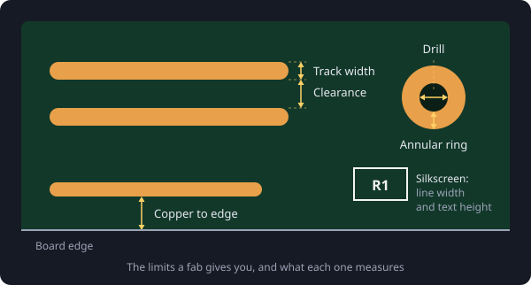

# Design rules

Every fab has limits: how thin a track it can etch, how small a hole it can drill, how close to the edge copper can go. Those limits are its **design rules**, and a board that breaks them is either rejected, charged extra, or made badly.

## The rules that matter most

- **Track width**: the thinnest track the fab can make reliably.
- **Clearance**: the smallest gap between two pieces of copper on different nets.
- **Drill size**: the smallest hole it can drill, usually for vias.
- **Annular ring**: the ring of copper left around a hole. Too thin, and a slightly off-centre drill breaks out of the pad.
- **Copper to edge**: how far copper has to stay from the board outline, so cutting the board does not expose or tear it.
- **Silkscreen**: the thinnest line and smallest text that still print legibly.

## Typical numbers

For a cheap standard two-layer board, the limits are usually around:

- Track width and clearance: **0.127 mm** (5 mil)
- Smallest drill: **0.3 mm**
- Annular ring: **0.13 mm**
- Copper to board edge: **0.3 mm**
- Silkscreen text: **1 mm** tall, with lines at least **0.15 mm** wide

These change from fab to fab and between their standard and advanced services, so always check the capabilities page of the one you use.

> Don't design at the limit. A board at 0.2 mm tracks and gaps is cheaper, more reliable and easier to fix by hand than one at 0.127 mm. Go down to the minimum only where a fine-pitch part forces you to.

## Letting Zolt check

In Zolt, open the board's **Design rules** and choose your fab under **Board house**: its limits become your rules. The design rule check then flags anything too thin, too close or too small while you work, instead of the fab rejecting it after you have ordered.
